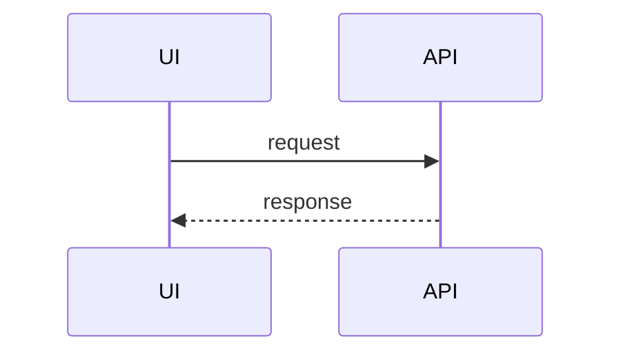

# Engineering Handbook

Team documentation built with [MkDocs Material](https://squidfunk.github.io/mkdocs-material/), deployed on GitHub Pages.

## 🚀 First time setup?

**Read [SETUP.md](./SETUP.md) first.** It's a ~10 minute walkthrough from zip → live site.

Once you're deployed, come back here for day-to-day usage.

---

## Quick start (for editing)

```bash
# Install dependencies
pip install -r requirements.txt

# Run the local dev server
mkdocs serve
```

Open http://127.0.0.1:8000 — hot reloads as you edit.

## How deployment works

1. Someone pushes to `main` (usually via PR).
2. GitHub Actions workflow (`.github/workflows/deploy.yml`) runs:
    - Installs Python dependencies
    - Builds the site with `mkdocs build --strict`
    - Uploads the built site to GitHub Pages
3. Live site updates in ~1 minute.

No manual deploy step. No local `mkdocs gh-deploy`. Just push and it's live.

## Repo structure

```
.
├── .github/workflows/
│   └── deploy.yml          # Auto-deploy to GitHub Pages
├── docs/
│   ├── index.md            # home page
│   ├── onboarding/         # new hire guide
│   ├── workflow/           # PRs, code review
│   ├── backend/            # Django patterns
│   ├── frontend/           # React patterns
│   └── general-principles.md
├── mkdocs.yml              # site config + sidebar nav
├── requirements.txt        # Python dependencies
├── README.md               # you are here
└── SETUP.md                # first-time setup guide
```

**To add a page:** drop a `.md` file in the appropriate folder, add it to the `nav:` section of `mkdocs.yml`, commit, push.

**To reorganize the sidebar:** edit the `nav:` section of `mkdocs.yml`. Order in the file = order on the site.

---

## Writing tips

### Callouts (admonitions)

Use these to highlight important info:

```markdown
!!! warning "Always commit migrations"
    Don't leave generated migrations uncommitted in your PR.

!!! tip
    Use `select_related` to avoid N+1 queries.

!!! note
    This is informational.

!!! danger
    Never commit secrets.
```

Available types: `note`, `tip`, `warning`, `danger`, `info`, `example`, `quote`, `abstract`, `success`, `question`, `failure`, `bug`.

Collapsible variant (starts collapsed):

```markdown
??? note "Click to expand"
    Hidden content.
```

### Code blocks with titles and highlights

````markdown
```python title="models.py" hl_lines="2 3"
class Article(models.Model):
    title = models.CharField(max_length=255)   # highlighted
    slug = models.SlugField(unique=True)       # highlighted
    body = models.TextField()
```
````

### Tabs

Useful for showing multiple approaches side by side:

```markdown
=== "Python"
    ​```python
    print("hello")
    ​```

=== "JavaScript"
    ​```javascript
    console.log("hello")
    ​```
```

### Mermaid diagrams

````markdown

````

### Internal links

Use relative paths to other markdown files:

```markdown
See [Pull Requests](../workflow/pull-requests.md) for details.
```

MkDocs rewrites these to the correct URLs at build time.

### Task lists

```markdown
- [x] Done
- [ ] To do
```

---

## Optional: add "last updated" dates to pages

If you want each page to show when it was last modified:

1. Add to `requirements.txt`:

    ```
    mkdocs-git-revision-date-localized-plugin
    ```

2. Uncomment the plugin in `mkdocs.yml`:

    ```yaml
    plugins:
      - search
      - git-revision-date-localized:
          enable_creation_date: true
    ```

3. Commit, push. Done.

---

## Privacy notes

The **repo** is private. The **built site** is public (GitHub Pages on Free/Pro/Team is always public).

This starter is configured so the public site contains **zero references to the repo**:

- No GitHub icon in the top right
- No "Edit this page" links
- No repo name in the footer

`repo_url` and `edit_uri` in `mkdocs.yml` are commented out. **Leave them commented** unless you want visitors to be able to click through to the repo.

---

## Docs as code

- Docs live alongside code conventions — changes go through the same PR process.
- If you change a pattern or add a new one, update the relevant page **in the same PR**.
- Treat stale docs as bugs. File an issue or open a PR.

---

## Need help?

- [MkDocs Material reference](https://squidfunk.github.io/mkdocs-material/reference/) — every feature, with examples
- [Admonition types](https://squidfunk.github.io/mkdocs-material/reference/admonitions/)
- [Code block features](https://squidfunk.github.io/mkdocs-material/reference/code-blocks/)
