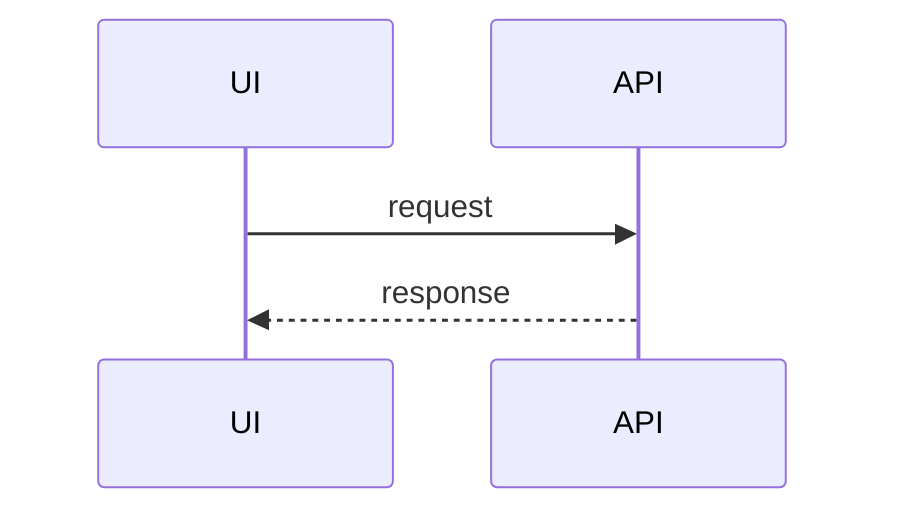

# Engineering Handbook

Team documentation — coding practices, workflows, and onboarding for new hires.

**📖 Live site:** `https://YOUR-ORG.github.io/engineering-handbook/` *(update this after your first deploy)*

---

## About this repo

This is the source for our team's engineering handbook. It's a living document covering:

- Onboarding for new hires
- Pull request and code review workflow
- Backend patterns (Django + DRF)
- Frontend patterns (React + TypeScript)
- General coding principles we apply everywhere

The site is built with [MkDocs Material](https://squidfunk.github.io/mkdocs-material/) and auto-deploys to GitHub Pages on every push to `main`.

## Contributing

Docs are code. Changes go through the same PR process as the rest of our work.

**If you change a pattern** (or add a new one), update the relevant page in the same PR.
**If you spot something wrong or outdated**, open a PR to fix it — no doc is sacred.

### Editing locally

```bash
# Install dependencies
pip install -r requirements.txt

# Run the dev server (hot reload on every save)
mkdocs serve
```

Open http://127.0.0.1:8000 and edit any markdown file under `docs/`. The browser auto-refreshes.

### Adding a new page

1. Create a `.md` file in the appropriate folder under `docs/`
2. Add it to the `nav:` section of `mkdocs.yml` (order in the file = order in the sidebar)
3. Commit and push

### Reorganizing the sidebar

Edit the `nav:` section of `mkdocs.yml`. That's it.

---

## Repo structure

```
.
├── .github/workflows/
│   └── deploy.yml          # Auto-deploys to GitHub Pages on push to main
├── docs/
│   ├── index.md            # Home page
│   ├── onboarding/         # New hire guide
│   ├── workflow/           # PRs, code review, branching
│   ├── backend/            # Django + DRF patterns
│   ├── frontend/           # React + TypeScript patterns
│   ├── general-principles.md
│   └── assets/             # Logo, custom CSS
├── mkdocs.yml              # Site config + sidebar nav
├── requirements.txt        # Python dependencies
├── SETUP.md                # First-time setup guide (only needed once)
└── README.md               # you are here
```

## How deployment works

1. Push to `main` (via PR).
2. GitHub Actions builds the site and deploys to GitHub Pages.
3. Live in ~1 minute.

No manual deploy step. Just merge your PR.

---

## Writing tips

### Callouts (admonitions)

Use these to highlight important info:

```markdown
!!! warning "Always commit migrations"
    Don't leave generated migrations uncommitted in your PR.

!!! tip
    Use `select_related` to avoid N+1 queries.

!!! note
    This is informational.

!!! danger
    Never commit secrets.
```

Available types: `note`, `tip`, `warning`, `danger`, `info`, `example`, `quote`, `abstract`, `success`, `question`, `failure`, `bug`.

Collapsible variant (starts hidden):

```markdown
??? note "Click to expand"
    Hidden content.
```

### Code blocks with titles and highlights

````markdown
```python title="models.py" hl_lines="2 3"
class Article(models.Model):
    title = models.CharField(max_length=255)   # highlighted
    slug = models.SlugField(unique=True)       # highlighted
    body = models.TextField()
```
````

### Tabs

````markdown
=== "Python"
    ```python
    print("hello")
    ```

=== "JavaScript"
    ```javascript
    console.log("hello")
    ```
````

### Mermaid diagrams

````markdown

````

### Internal links

Use relative paths. MkDocs rewrites them to correct URLs at build time.

```markdown
See [Pull Requests](../workflow/pull-requests.md) for details.
```

---

## Theme and branding

- **Logo** lives at `docs/assets/logo.png`. Replace this file to update the logo site-wide.
- **Colors and fonts** are controlled by `docs/assets/extra.css`. Edit the HSL values at the top to tweak the navy shade or swap the font stack.
- **Light mode** is the default. Users can toggle dark mode with the sun/moon icon in the top right.

### Tweaking the color palette

In `docs/assets/extra.css`:

```css
/* Header color (applies to both light and dark mode) */
.md-header, .md-tabs {
  background-color: hsl(220, 45%, 15%);  /* dark navy */
}

/* Dark mode body background */
[data-md-color-scheme="slate"] {
  --md-default-bg-color: hsl(220, 40%, 10%);
}
```

HSL format: `hsl(hue, saturation, lightness)`. Hue 210–225 is the navy range. Lower lightness = darker.

---

## Privacy

The **repo is private**. The **built site is public** (GitHub Pages on Free/Pro/Team is always public).

This repo is configured so the public site contains **zero references back to the repo**:

- No GitHub icon in the header
- No "Edit this page" links
- No repo name in the footer

If you want to change this and expose the repo, uncomment `repo_url` and `edit_uri` in `mkdocs.yml`.

---

## Troubleshooting

**Build failing on GitHub Actions?** Open the Actions tab, click the failing run, expand the "Build site" step. Usually a typo in `mkdocs.yml` or a broken link in a markdown file. The workflow uses `--strict` mode so warnings fail the build.

**Local `mkdocs serve` failing?** Make sure you ran `pip install -r requirements.txt` first and you're on Python 3.8+.

**404 on a page that exists?** MkDocs URLs don't include `.md`. `docs/backend/models.md` → `/backend/models/`.

---

## Resources

- [MkDocs Material reference](https://squidfunk.github.io/mkdocs-material/reference/) — every feature, with examples
- [Admonition syntax](https://squidfunk.github.io/mkdocs-material/reference/admonitions/)
- [Code block features](https://squidfunk.github.io/mkdocs-material/reference/code-blocks/)
