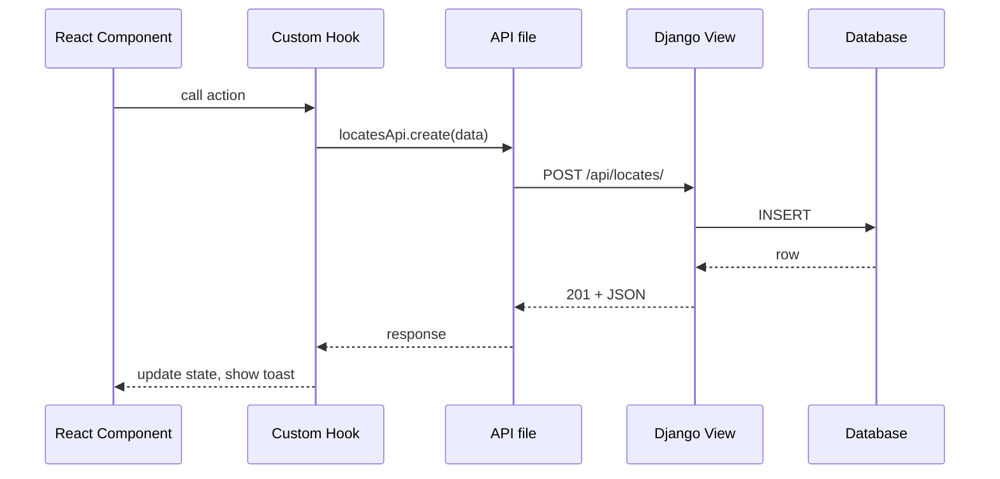

# Codebase Tour

A map of the repo so you know where to look for things. For deeper detail on conventions within each area, see the [Backend](../backend/index.md) and [Frontend](../frontend/index.md) sections.

## Top-level layout

```
your-repo/
├── Back-End/       # Django + DRF API
├── Front-End/      # React + TypeScript SPA
└── ...
```

## Backend (`Back-End/`)

Django apps are grouped under the project root. Each app owns its own models, views, serializers, and URLs.

```
Back-End/
├── CLRPLN/         # project config (settings, root urls, wsgi)
├── UserAuth/       # authentication and user management
├── WIP/            # Work-In-Progress reporting — parent app
│   ├── sheets/         # sub-app
│   ├── misc_reports/   # sub-app
│   ├── reviewer_reports/
│   └── system/
├── manage.py
└── requirements.txt
```

**Where to look:**

- URL routing: `CLRPLN/urls.py` includes each app's `urls.py`
- Settings / env: `CLRPLN/settings.py`, `CLRPLN/.env`
- Business logic: inside each app, usually in `models.py` or a `services.py`

See [Backend → Project Structure](../backend/project-structure.md) for conventions.

## Frontend (`Front-End/`)

Feature-based organization under `src/apps/`, with shared code under `src/shared/`.

```
Front-End/src/
├── apps/           # one folder per feature area
│   ├── auth/
│   ├── dashboard/
│   └── orders/
├── shared/         # cross-cutting components, hooks, utils
├── config/         # env, routes, constants
└── App.tsx
```

Each app follows the same internal shape: `components/`, `hooks/`, `api/`, `types/`, `styles/`, `index.ts`. See [Frontend → Project Structure](../frontend/project-structure.md).

## How a request flows end-to-end

A typical "user clicks a button → data updates" flow:



Knowing this flow helps when debugging — trace from the component, into the hook, into the API file, into the Django view.
